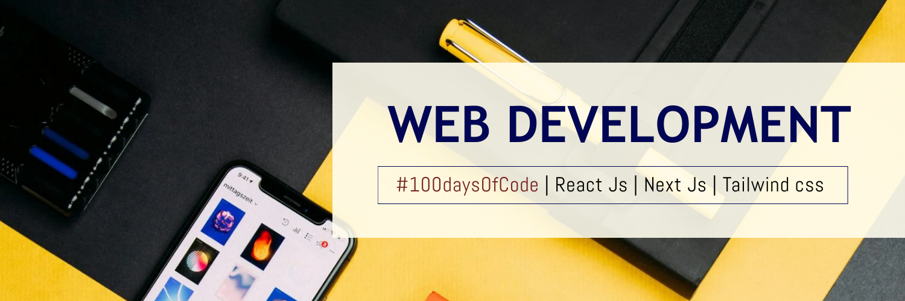

<h1 align="center" style="font-size: 68px;">Hi 👋, I'm Ayush Kumar</h1>
<h3 align="center" style="font-size: 46px;">I'm a passionate web developer and app developer interested in creating awesome applications</h3>

  

  

- 🔭 I’m currently working on DigiPahchan, a project designed to help people easily locate and identify their precious belongings.**

- 🌱 I’m currently learning: **Next.js, along with backend development using Node.js & Express.**

- 💬 Ask me about: **React.js, Supabase, Next.js, Node.js, APIs, React Native.**

- 📫 How to reach me: **anuj846k@gmail.com**

- ⚡ Fun fact: **I thrive in focused, goal-oriented environments and am driven by meaningful, impactful work.**

---

## #30NitesOfCode:
[Check out my progress!](https://www.codedex.io/@anuj846k70317/30-nites-of-code)  

---

<h3 align="left">Connect with me:</h3>

---

<h3 align="left">Languages and Tools:</h3>

 
   
   
   
   
   
   
   
   

---
## Holopin Badges 👀  

