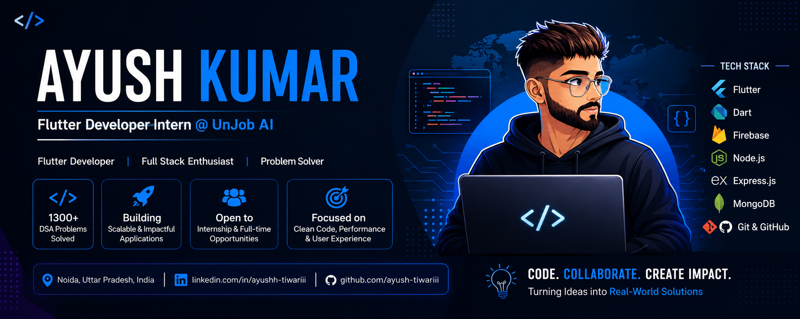

# Hey, I'm Ayush Tiwari 👋

**Flutter App Developer** · Building smooth, scalable mobile experiences from idea to production

---

## 🟢 Currently

- 📱 **Flutter App Developer Intern @ [UnJob.ai](https://unjob.ai)** — contributing to a live production mobile application
- 🔥 Deepening skills in **Flutter architecture · Firebase · REST APIs · Node.js & Express**
- 🧩 Active on [#30NitesOfCode](https://www.codedex.io/@Ayushkr926/30-nites-of-code) — building every night
- ⚡ I love turning complex requirements into smooth, user-friendly mobile experiences and thrive in fast-paced product teams

---

## 🛠️ Tech Stack

### 📱 Mobile (Primary Focus)

### 🌐 Backend & Web

### 🧠 Languages & ML

---

## 💬 Ask Me About

`flutter` `firebase` `dart` `rest-api` `state-management` `bloc` `provider` `mobile-ui` `node.js` `scalable-apps`

---

## 📊 GitHub Stats

  
  

  

---

## 🧠 LeetCode Stats

  
  &nbsp;
  

---

## 🏅 Holopin Badges

---

## #30NitesOfCode Progress

---

  <i>⚡ "Turning complex requirements into smooth, user-friendly mobile experiences — one widget at a time."</i>

